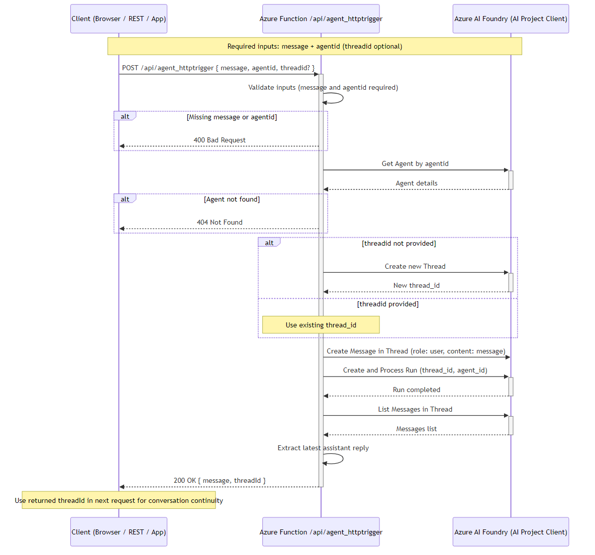

# azure-ai-foundry-agent

## Overview

The `azure-ai-foundry-agent` is a Python-based Azure Function application designed to interact with Azure AI Projects. It provides an HTTP-triggered endpoint for processing user messages and generating responses using AI agents.

This application is built to:
1. Handle user requests with message input.
2. Retrieve or create an AI agent thread.
3. Interact with the Azure AI Project API to process messages.
4. Generate responses based on AI agent capabilities.

## Features

- **HTTP Trigger**: Provides an anonymous endpoint `/agent_httptrigger` to accept user inputs.
- **Integration with Azure AI Projects**: Uses the `azure-ai-projects` library to manage AI agents, threads, and messages.
- **Error Handling**: Includes robust error checking and logging to ensure smooth operation.

## Prerequisites

To run this project, ensure that you have:
1. Azure Functions Core Tools installed.
2. Python 3.8 or later.
3. Required libraries listed in `requirements.txt`.
4. Azure Subscription to set up required resources like AI Projects.

## Installation

1. Clone the repository:
    ```bash
    git clone https://github.com/azure-data-ai-hub/azure-ai-foundry-agent.git
    cd azure-ai-foundry-agent
    ```

2. Install dependencies:
    ```bash
    pip install -r requirements.txt
    ```

3. Set up environment variables:
    - Add `AIProjectConnString` to your local settings or environment variables. This is crucial for connecting to Azure AI Projects.

4. Run the Azure Function locally:
    ```bash
    func start
    ```

## HTTP Trigger Details

### Endpoint

`POST /agent_httptrigger`

### Query Parameters

| Name       | Type   | Description                          |
|------------|--------|--------------------------------------|
| `message`  | string | The user message to process.         |
| `agentid`  | string | The ID of the AI agent.              |
| `threadid` | string | (Optional) The thread ID for context.|

### Request Example

```json
{
  "message": "Hello, AI Agent!",
  "agentid": "agent123",
  "threadid": "thread456"
}
```

## Architecture & Flow

The diagram below illustrates the end-to-end request flow when a client calls the Azure Function:



### Flow Summary

1. **Client sends a POST** with `message` + `agentid` (and optionally `threadid`).
2. The function **validates inputs**, then authenticates to Azure AI Foundry via `DefaultAzureCredential`.
3. It **retrieves the agent**, creates (or reuses) a conversation thread, posts the user message, and triggers a run.
4. The agent **processes the message** and the function extracts the latest assistant reply.
5. The response returns the AI-generated `message` plus the `threadId` — the client can pass this `threadId` back in subsequent requests to **maintain conversation continuity**.

## Environment Variables

Configure the following settings in `local.settings.json` (local development) or in your Azure Function App's **Application Settings** (deployed).

| Variable | Required | Description |
|---|---|---|
| `AIProjectEndpoint` | **Yes** | The endpoint URL for your Azure AI Foundry project (e.g. `https://<resource>.services.ai.azure.com/api/projects/<project>`). Used to authenticate and communicate with the AI Project Client. |
| `FUNCTIONS_WORKER_RUNTIME` | **Yes** | Must be set to `python`. Tells the Azure Functions host which language runtime to use. |
| `AzureWebJobsStorage` | **Yes** | Connection string for the Azure Storage account used by the Functions host. Use `UseDevelopmentStorage=true` for local development with Azurite. |
| `AzureWebJobsFeatureFlags` | **Yes** | Set to `EnableWorkerIndexing` to enable the Python v2 programming model. |
| `ModelDeploymentName` | No | The name of the model deployment to use (e.g. `gpt-4o`). Only needed if your agent logic references it. |
| `AGENT_ID` | No | A default agent ID. The HTTP trigger accepts `agentid` per request, but this can serve as a fallback or reference. |
| `AGENT_INSTRUCTIONS_TEMPLATE` | No | A template string for the agent's system instructions. Supports placeholders like `{username}` for personalization. |

### Authentication

The function uses `DefaultAzureCredential` from the `azure-identity` SDK, which automatically picks up credentials from (in order):

1. **Environment variables** (`AZURE_CLIENT_ID`, `AZURE_TENANT_ID`, `AZURE_CLIENT_SECRET`)
2. **Managed Identity** (when deployed to Azure)
3. **Azure CLI / VS Code** (for local development)

No API keys are passed in code — ensure the identity running the function has the appropriate **Azure AI Developer** (or equivalent) role on the AI Foundry project.
